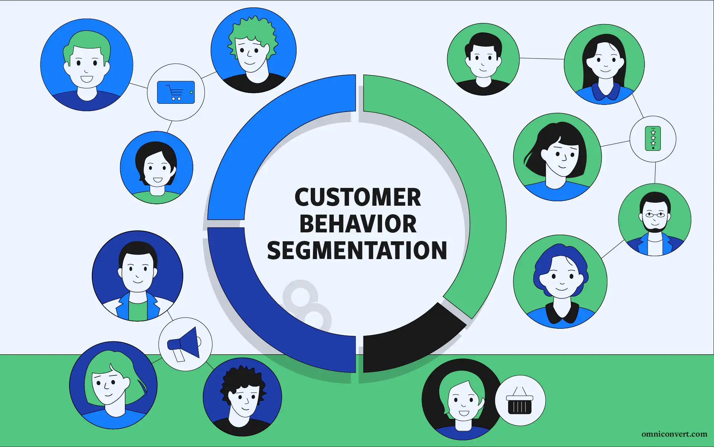
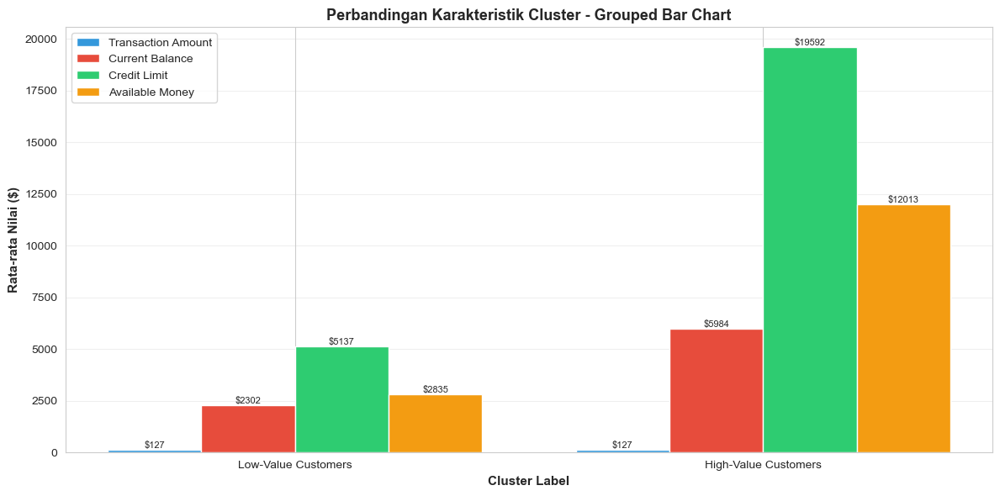

# Customer Segmentastion dengan metode K-Means Clustering

## Background
Dalam industri jasa keuangan, pemahaman terhadap karakteristik dan perilaku pelanggan menjadi faktor penting dalam pengambilan keputusan bisnis, seperti pengelolaan risiko kredit, penentuan strategi pemasaran, dan peningkatan profitabilitas. Meskipun pelanggan dapat memiliki pola transaksi yang relatif serupa, kemampuan finansial mereka sering kali berbeda secara signifikan, seperti pada batas kredit, saldo berjalan, dan dana yang tersedia.
Tanpa segmentasi yang tepat, perusahaan berisiko menerapkan strategi yang bersifat umum dan kurang efektif untuk seluruh pelanggan. Oleh karena itu, diperlukan pendekatan berbasis data untuk mengelompokkan pelanggan ke dalam segmen yang memiliki karakteristik finansial yang serupa. Analisis clustering digunakan untuk mengidentifikasi pola tersembunyi dalam data pelanggan sehingga perusahaan dapat merancang strategi yang lebih terarah dan tepat sasaran.

## Objective
Tujuan dari analisis ini adalah untuk melakukan segmentasi pelanggan menggunakan metode clustering berdasarkan karakteristik transaksi dan kondisi finansial pelanggan. Secara spesifik, analisis ini bertujuan untuk:
1. Mengelompokkan pelanggan ke dalam segmen High-Value Customers dan Low-Value Customers
2. Mengidentifikasi perbedaan karakteristik finansial antar segmen, seperti credit limit, current balance, dan available money
3. Memberikan insight yang dapat mendukung pengambilan keputusan berbasis data
4. Menjadi dasar dalam penyusunan strategi bisnis, manajemen risiko, dan penargetan pelanggan yang lebih efektif

## Dataset Overview

## Methodology (Clustering Approach)
K-Means clustering with elbow methode

## Temuan Utama:

- Terdapat 2 segmen utama customer:
1. High-Value Customers
2. Low-Value Customers

- Perbedaan signifikan ada di:
1. Credit Limit
2. Current Balance
3. Available Money

- Low-Value Customers jumlahnya jauh lebih besar, tapi: Memiliki daya finansial lebih rendah

- High-Value Customers lebih sedikit, tapi: Punya potensi profit dan risiko finansial lebih besar

## Key Insights
Berdasarkan hasil clustering, diperoleh dua segmen pelanggan dengan karakteristik yang berbeda. Meskipun rata-rata nilai transaksi antar segmen relatif serupa, terdapat perbedaan yang signifikan pada kapasitas finansial pelanggan. Segmen High-Value Customers memiliki batas kredit dan dana tersedia yang jauh lebih tinggi, meskipun jumlah pelanggannya lebih sedikit. Sebaliknya, segmen Low-Value Customers memiliki jumlah pelanggan yang lebih besar, namun dengan kapasitas finansial yang lebih rendah.

## Business Impact
Hasil segmentasi ini dapat dimanfaatkan untuk:
1. Menyusun strategi penawaran produk premium dan loyalti bagi High-Value Customers
2. Menerapkan pengelolaan risiko kredit yang lebih ketat pada Low-Value Customers
3. Mengoptimalkan alokasi sumber daya pemasaran dan operasional
4. Mendukung strategi bisnis yang lebih efisien dan berbasis data

## Conclusion
Berdasarkan hasil analisis clustering yang telah dilakukan, pelanggan berhasil dikelompokkan ke dalam dua segmen utama, yaitu High-Value Customers dan Low-Value Customers, berdasarkan karakteristik transaksi dan kondisi finansial. Hasil analisis menunjukkan bahwa meskipun rata-rata nilai transaksi antar segmen relatif serupa, terdapat perbedaan yang signifikan pada kapasitas finansial pelanggan, seperti batas kredit, saldo berjalan, dan dana yang tersedia.
Segmen High-Value Customers memiliki potensi kontribusi bisnis yang lebih besar meskipun jumlahnya lebih sedikit, sementara segmen Low-Value Customers mendominasi jumlah pelanggan namun dengan kapasitas finansial yang lebih rendah. Temuan ini menegaskan pentingnya pendekatan segmentasi pelanggan berbasis data untuk mendukung pengambilan keputusan bisnis yang lebih tepat, efektif, dan terukur.
